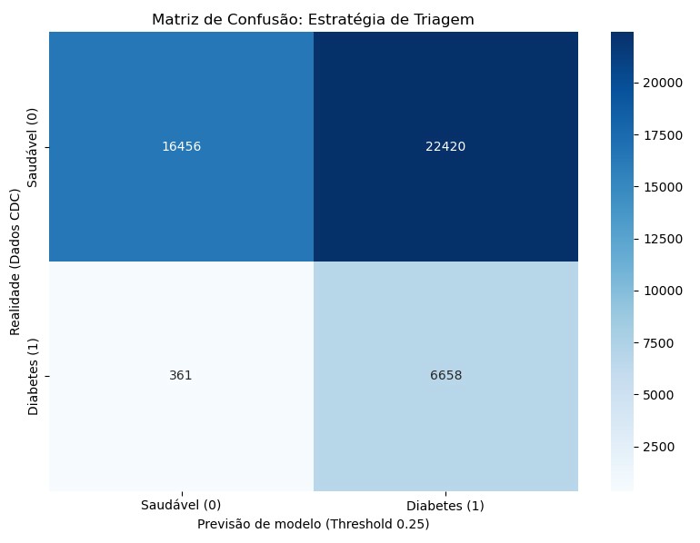

# diabetes

🏥 Sistema de Triagem Inteligente: Diabetes Risk Predictor

Este projeto apresenta uma solução de Machine Learning para a identificação precoce de risco de diabetes, utilizando a base de dados histórica do CDC (Centers for Disease Control and Prevention). O objetivo principal é fornecer uma ferramenta de apoio à decisão clínica focada em alta sensibilidade (Recall) para triagens populacionais.

🚀 Link do Aplicativo

https://diabetes-f4epva3sgnffuiahzwb794.streamlit.app

📋 Contexto e Objetivos

O diabetes é uma doença crônica com alto impacto socioeconômico. Este modelo foi desenvolvido para transformar indicadores de saúde e estilo de vida em probabilidades de risco, permitindo intervenções preventivas antes do agravamento do quadro clínico.

🛠️ Metodologia e Tecnologias

Algoritmo Principal: LightGBM (LGBM) otimizado via Busca Aleatória (Random Search).

Pré-processamento: Tratamento de dados desbalanceados, remoção de duplicatas e exclusão de variáveis com vazamento de dados (Data Leakage) como MentHlth e PhysHlth.

Interpretabilidade: Utilização de valores SHAP para explicar as predições globais e individuais do modelo.

📈 Resultados Técnicos

O modelo foi calibrado para priorizar a captura de casos positivos, resultando em:

Recall (Sensibilidade): 94,86% (identificando 6.658 casos reais no teste).

ROC-AUC: 0,8165.

Threshold Clínico: 0,25 (Ponto de corte otimizado para triagem preventiva).

📊 Matriz de Confusão e Estratégia Clínica
Para este projeto, priorizamos a **Sensibilidade (Recall)**, visando a detecção precoce.

*A imagem acima detalha a performance do modelo utilizando o Threshold de 0.25, onde identificamos 94.86% dos casos reais de diabetes.*

📂 Estrutura do Repositório

diabetes.py: O arquivo principal com o código do Streamlit.

modelo_diabetes_vtl.pkl: O arquivo binário contendo o modelo LGBM Classifier, o scaler e o threshold de 0,25.

requirements.txt: A lista de dependências (pandas, scikit-learn, xgboost, etc.) para o deploy.

matriz_confusao.svg: A imagem vetorial da sua matriz de performance que será exibida no README e no App.

README.md: O documento de apresentação do projeto com o link do app e as explicações técnicas.

Projeto - Diabetes.pdf: (Opcional, mas recomendado) A versão final do seu relatório escrito para que o avaliador tenha tudo em um só lugar.

💻 Como Executar Localmente

Clone o repositório: git clone https://github.com/seu-usuario/diabetes.git

Instale as dependências: pip install -r requirements.txt

Execute o app: streamlit run diabetes.py
